- [1. What I completed](#1-what-i-completed)
- [2. Deployment](#2-deployment)
  - [2.1. How to test on the Django swagger page](#21-how-to-test-on-the-django-swagger-page)
  - [2.2. How to test on the FastAPI swagger page](#22-how-to-test-on-the-fastapi-swagger-page)
- [3. Run unit test](#3-run-unit-test)
  - [3.1. Test django api](#31-test-django-api)
  - [3.2. Test fastapi](#32-test-fastapi)
- [4. Test rate limit](#4-test-rate-limit)
- [5. Optimization and missing parts](#5-optimization-and-missing-parts)


# 1. What I completed

1. Create a search employee API using Django and DRF in [src_django](src_django) folder, with below features:
   1. Apply authentication and authorization:
      1. Anonymous users can not call API
      2. The super user can list all the employees of all the companies in the system
      3. The department manager of a company can only list the employees of that company
   1. Create a Django command to generate 1 million records to test: [create_sample_data.py](src_django/employee/management/commands/create_sample_data.py)
   2. Create a table in the database for storing dynamic columns configuration
   3. Create unit test for search API in this file [test_api_search_employee.py](src_django/employee/tests/test_api_search_employee.py) using `unittest`
   4. Apply rate-limiting to API using Django throttle and set the default rate is 2 requests per 10 seconds
   5. Add pagination
   6. Create API docs in Swagger: http://206.189.153.143:8000/swagger/
1. Create a search employee API using FastAPI in [src_fastapi](src_fastapi) folder, using same database with Django API, with the below features:
   1. Create API docs in Swagger: http://206.189.153.143:8001/docs 
   2. Implement my own rate-limiting in this file [rate_limiter.py](src_fastapi/rate_limiter.py), and set the default rate is 2 requests per 10 seconds
   3. Return dynamic columns based on the configuration in the DynamicColumn table for each company, if there's no company parameter in query param, the API will return all the fields of Employee object
   4. Create unit test for search API in this file [test_api_search_employee.py](src_fastapi/tests/test_api_search_employee.py) using `pytest`, `factory-boy`
   5. Implement my own authentication and authorization to check:
      1. Anonymous users can not call API
      2. The super user can list all the employees of all the companies in the system
      3. The department manager of a company can only list the employees of that company
   6. Validate all input query parameters
   7. Add pagination
2. Deploy this project to Digital Ocean
3. Containerise services
4. Setup debuging in container using debugpy and vscode

   
# 2. Deployment

Environment:

    Ubuntu 22.04.3 LTS
    Docker version 24.0.7, build afdd53b
    Python 3.9.0

Install `make` command line:

```shell
sudo apt-get -y install make
```

Setup project:

```shell
cd backend_assignment
make setup-new-project
```

It will do the following tasks:

- Build docker image
- Create a new database
- Start all services
- Migrate database
- Create superuser
- Create sample data for testing, it will create 1 million records, so this task may take a while
- Collect static files

Access web pages:

- Django Admin: http://localhost:8000/admin and login with superuser `username/password`: `admin/admin`
- Django Swagger: http://localhost:8000/swagger/
- FastAPI Swagger: http://localhost:8001/docs/

This project was deployed to Digital Ocean, you can also test with these links:

- Django Admin: http://206.189.153.143:8000/admin/  login with superuser `username/password`: `admin/admin`
- Django Swagger: http://206.189.153.143:8000/swagger/
- FastAPI Swagger: http://206.189.153.143:8001/docs/

Screenshot of Django admin page and swagger pages:

`Employee` table

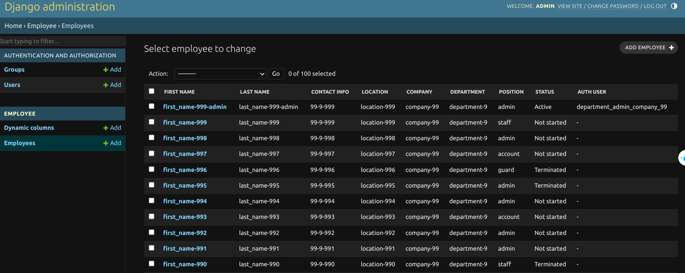

`Dynamic column` table to specify which column will be returned in the API's response

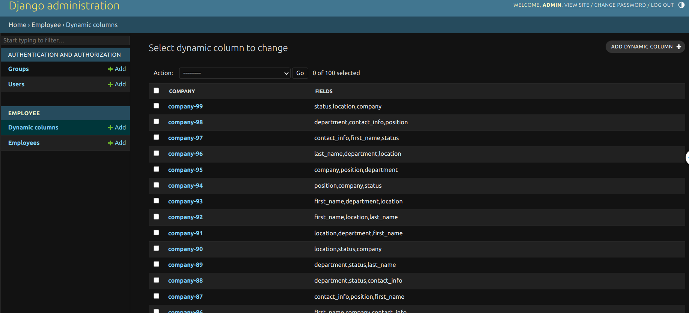

Django Swagger

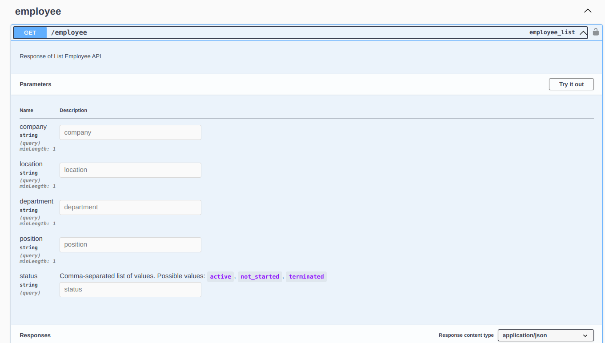

FastAPI Swagger

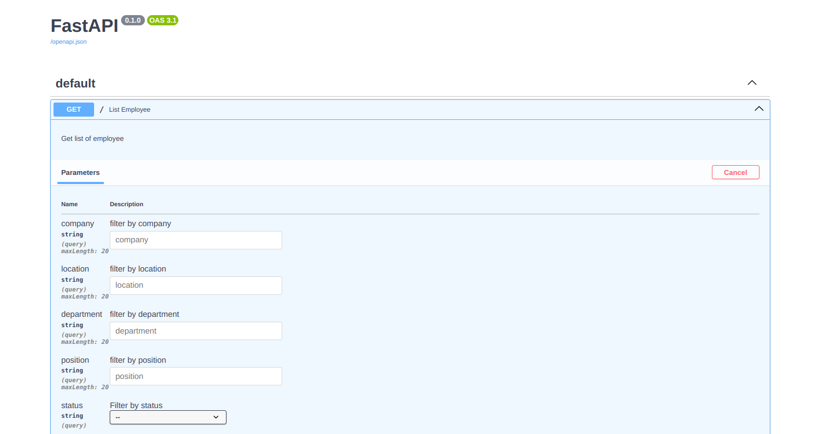

## 2.1. How to test on the Django swagger page

Access this link: http://206.189.153.143:8000/swagger/ or http://localhost:8000/swagger/ if you want to test locally

Click to `Authorize` button and enter one of these accounts:

- superuser account: `username/password` : `admin/admin` (see the below images)
  - using this account, you can list all the employees of all the companies
  - if you don't filter by company name, it will return all the fields of Employee object
  - if you filter by company name, it will only return the fields that are configured in DynamicColumn table
- department's manager of the `company-99`: `username/password` : `department_manager_company_99/1234`
  - using this account, you can only list the employees of `company-99`
  - if trying to list employees of another company you will get 403 error
  - the response only contains dynamic columns that are configured in `Dynamic Table` (see the below images)


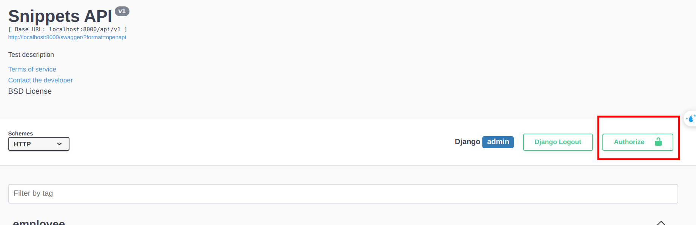

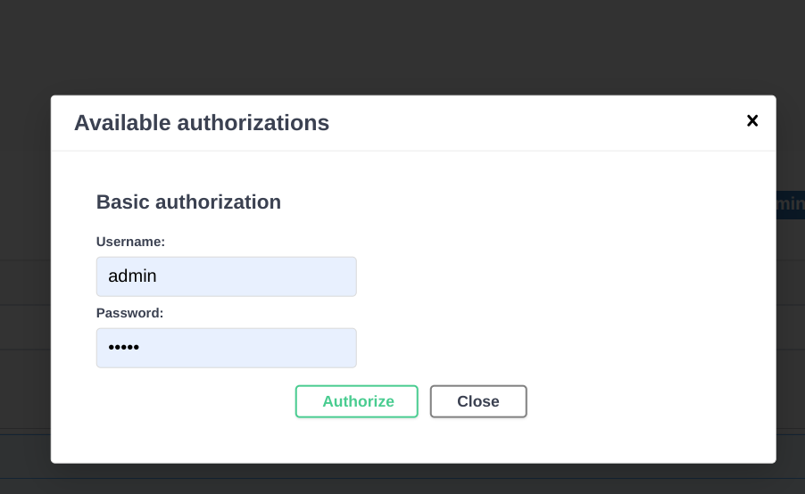


The below image is the result when testing with account `department_manager_company_99`, the API will return only fields: first_name, last_name, status, company, department, contact_info. As the configuration of the `company-99` in the `Dynamic Column` table

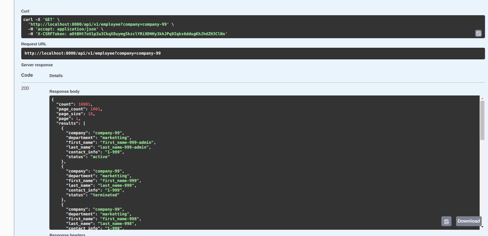

Using account `department_manager_company_99` and list employees of another company will get 403 error

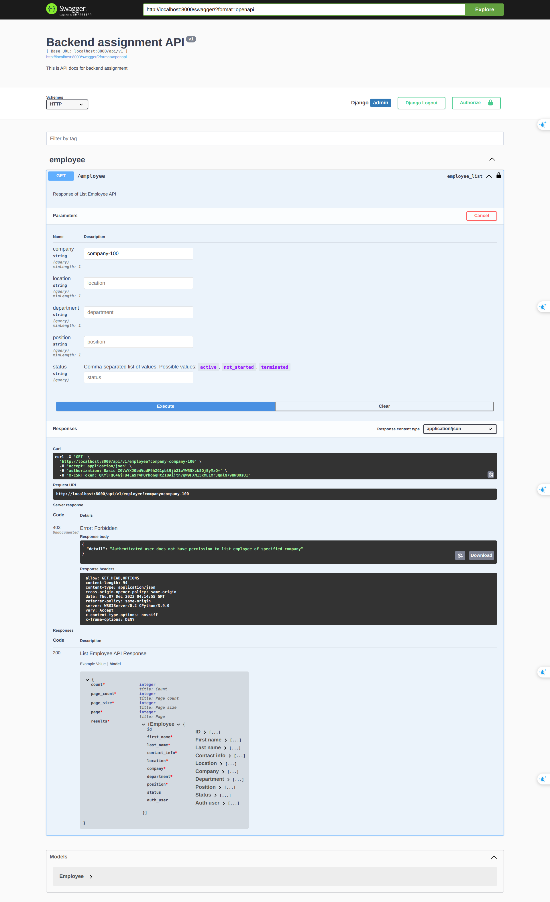

The below image is the result when testing with account `admin/admin`, the API will return all the fields of the employee object

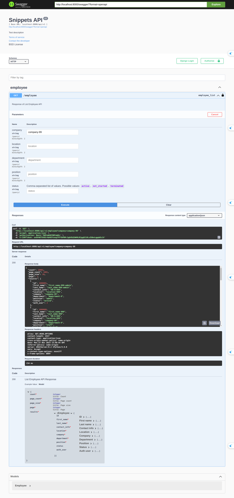

## 2.2. How to test on the FastAPI swagger page

Access this link: http://206.189.153.143:8001/docs or Access this link: http://localhost:8001/docs if you want to test locally

Click to `Authorize` button and enter one of these accounts:

- superuser account: `username/password` : `admin/admin` (see the below images)
  - using this account, you can list all the employees of all the companies
  - if you don't filter by company name, it will return all the fields of Employee object
  - if you filter by company name, it will only return the fields that are configured in DynamicColumn table
- department's manager of the `company-99`: `username/password` : `department_manager_company_99/1234`
  - using this account, you can only list the employees of `company-99`
  - if trying to list employees of another company you will get 403 error
  - the response only contains dynamic columns that are configured in `Dynamic Table` (see the below images)

**Using the superuser account to list employees of all the companies:**

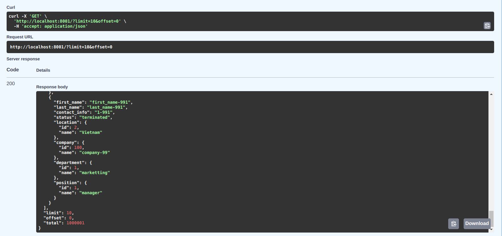

**Using department's manager of the `company-99` to list all employees of the `company-99`**

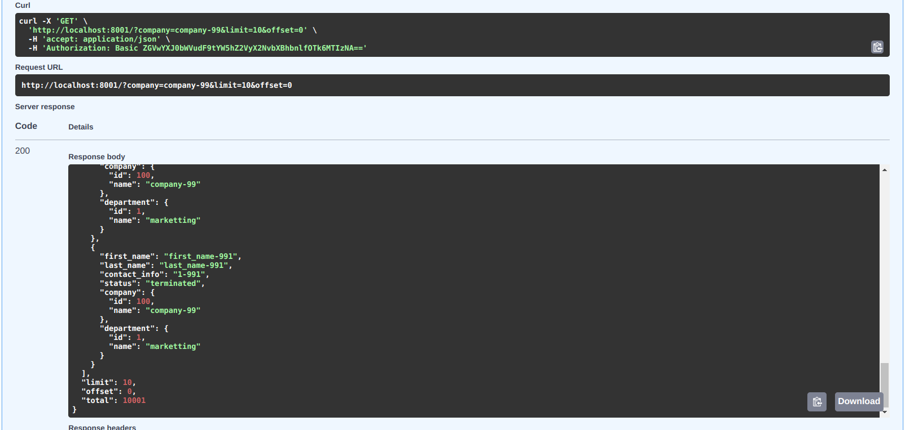

**Using department's manager of the `company-99` to list all employees of another company will get 403 error**

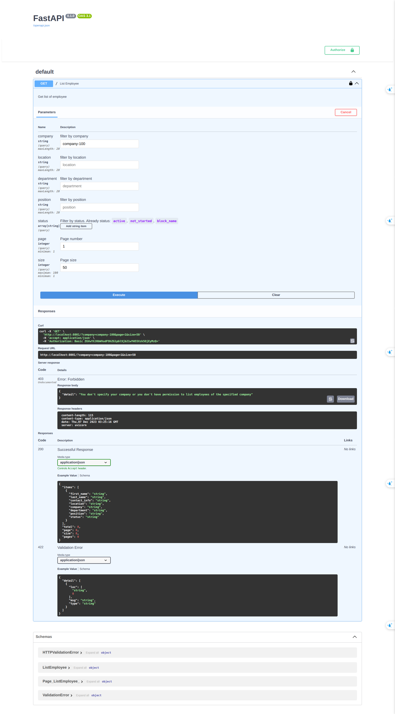

# 3. Run unit test

## 3.1. Test django api

Test file for search API is in this file [src_django/employee/tests/test_api_search_employee.py](src_django/employee/tests/test_api_search_employee.py)

The tests in this file were created using `unittest` and `TestClient` of `Django`

run test command

```shell
cd backend_assignment
make test-django-api
```

## 3.2. Test fastapi

Test file for search API is in this file [src_fastapi/tests/test_api_search_employee.py](src_fastapi/tests/test_api_search_employee.py)

The tests in this file were created using `pytest`, `factory-boy`, and `TestClient` of FastApi

run test command

```shell
cd backend_assignment
make test-fastapi
```

# 4. Test rate limit

When you call Django API or Fast API more than 3 times in 10 seconds, you will receive 429 http error as below:

For Django API

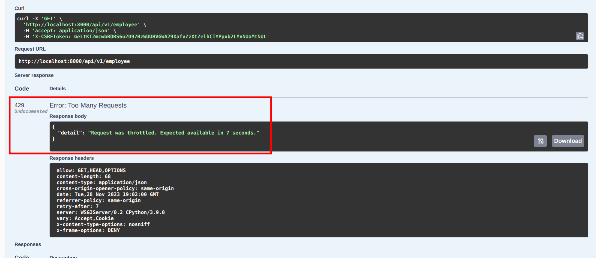

For Fast API:

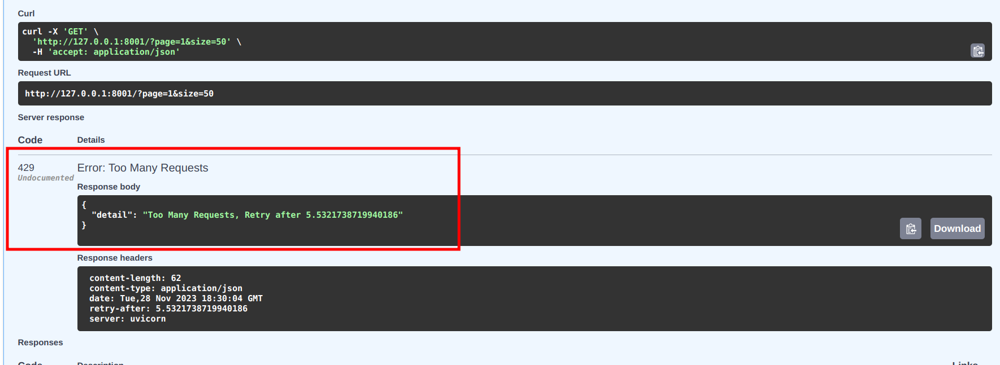

# 5. Optimization and missing parts

Fast API: 

1. Update response format to return only the name of the company, location, postion and department
2. Optimize sqlalchemy query when querying foreign key data same as select_related in Django
